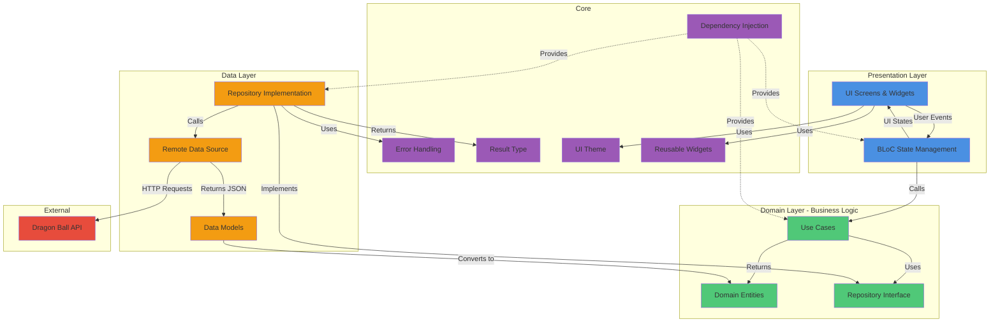
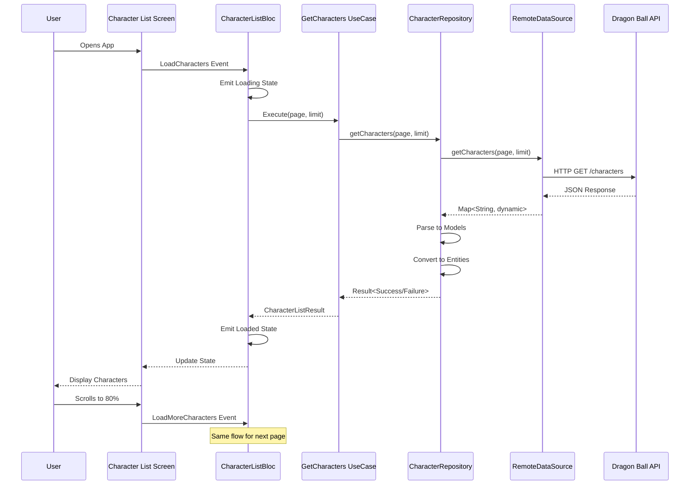
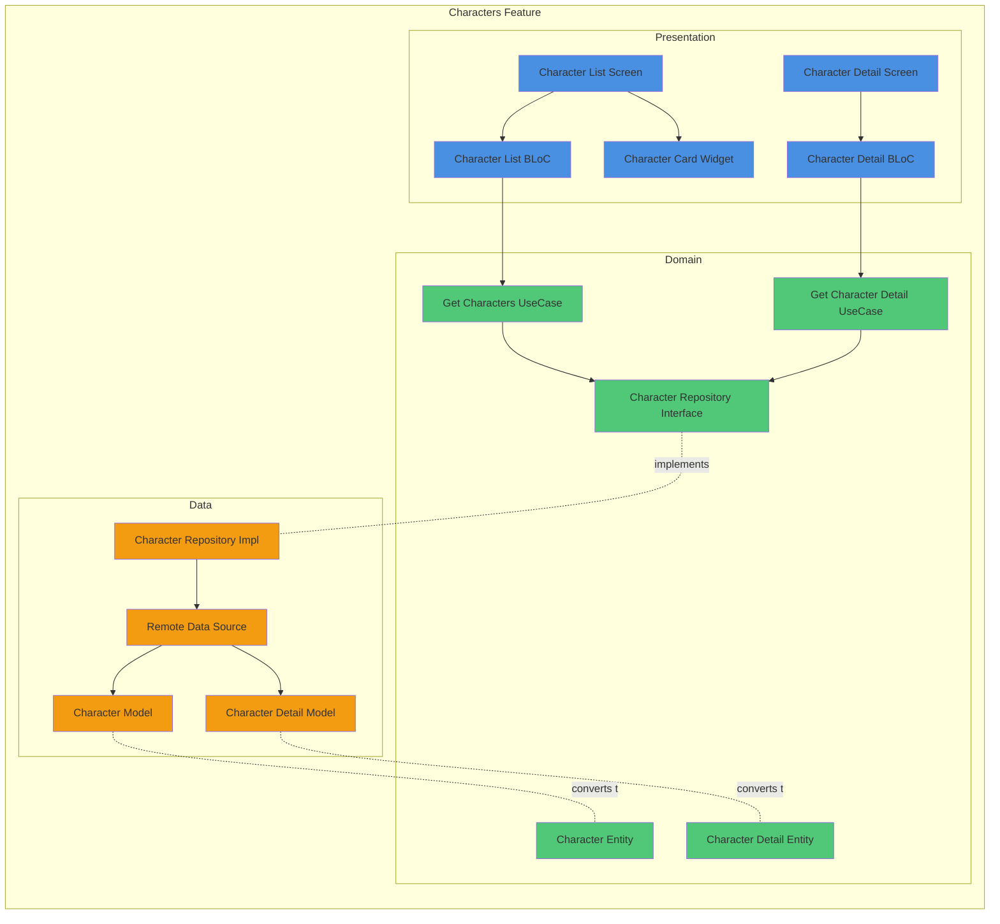
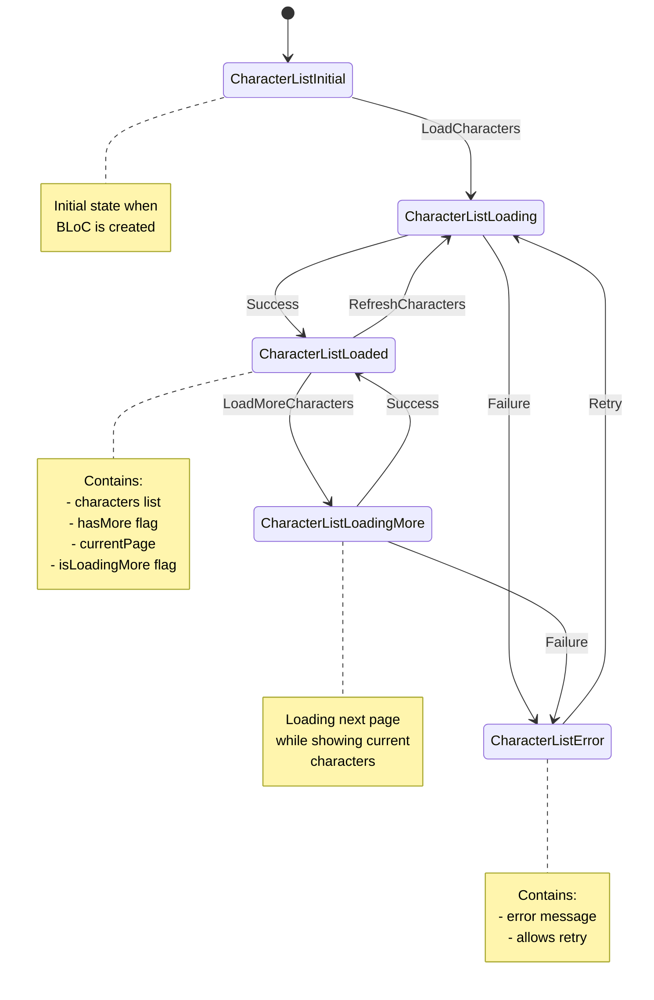
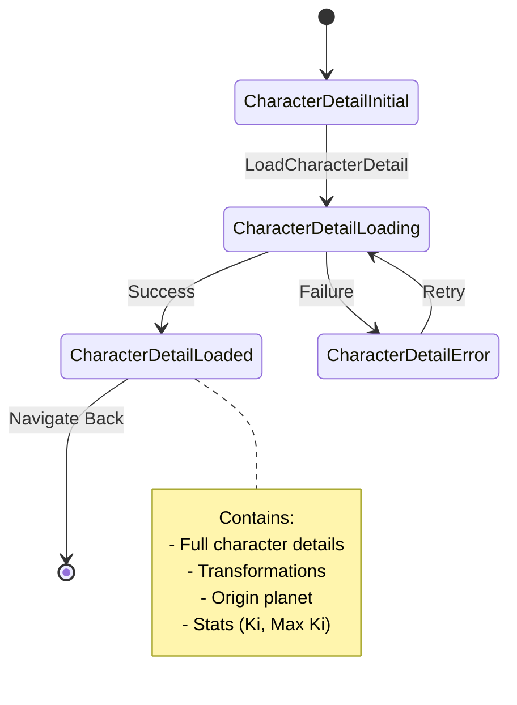
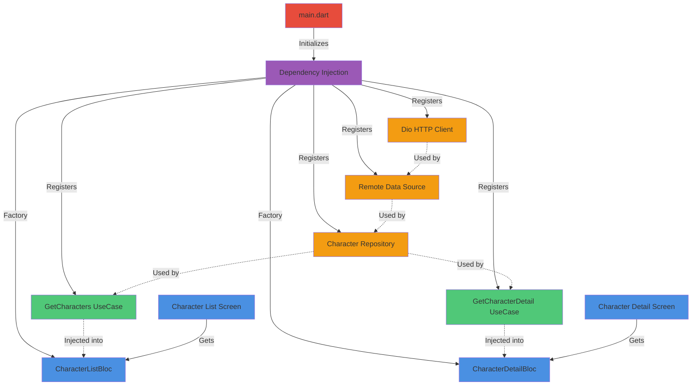
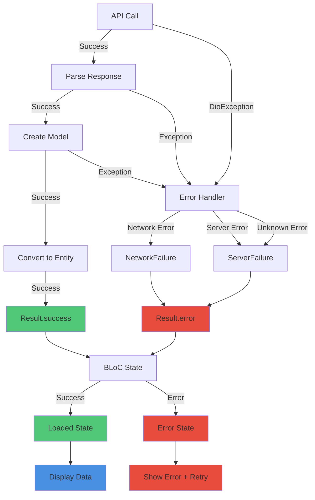

# Dragon Ball App - Architecture Documentation

This document provides a comprehensive visual guide to the architecture and data flow of the Dragon Ball Characters application.

## Table of Contents
- [Overview](#overview)
- [Clean Architecture Layers](#clean-architecture-layers)
- [Data Flow](#data-flow)
- [Component Structure](#component-structure)
- [State Management](#state-management)

---

## Overview

This application follows **Clean Architecture** principles with three distinct layers:
- **Presentation Layer** (UI & State Management)
- **Domain Layer** (Business Logic)
- **Data Layer** (External Data Sources)

---

## Clean Architecture Layers

### Layer Responsibilities

#### 🔵 Presentation Layer
- **UI Components**: Screens, widgets, custom painters
- **State Management**: BLoC pattern for managing UI state
- **User Interactions**: Handling taps, scrolls, navigation

#### 🟢 Domain Layer (Core Business Logic)
- **Entities**: Pure business objects (Character, Planet, etc.)
- **Use Cases**: Application-specific business rules
- **Repository Interfaces**: Contracts for data operations

#### 🟠 Data Layer
- **Repository Implementations**: Concrete data access logic
- **Data Sources**: API communication (Remote) or local storage
- **Data Models**: JSON serialization/deserialization

#### 🟣 Core Layer
- **Dependency Injection**: GetIt service locator
- **Error Handling**: Custom exceptions and failures
- **Shared Utilities**: Reusable widgets, themes, constants

---

## Data Flow

This sequence diagram shows how data flows through the application from user interaction to API call and back:

### Data Transformation Journey

1. **API Response** (JSON) → Raw data from Dragon Ball API
2. **Data Models** → Parsed JSON with type safety
3. **Domain Entities** → Pure business objects
4. **BLoC State** → UI-ready data with loading/error states
5. **UI Widgets** → Visual representation

---

## Component Structure

This diagram shows the detailed architecture of the Characters feature:

### Component Relationships

- **Screens** depend on **BLoCs** for state management
- **BLoCs** depend on **Use Cases** for business logic
- **Use Cases** depend on **Repository Interfaces** (not implementations)
- **Repository Implementations** depend on **Data Sources**
- **Data Models** convert to **Domain Entities**

---

## State Management

BLoC (Business Logic Component) pattern manages all UI states:

### Character Detail BLoC States

---

## Dependency Injection Flow

---

## Error Handling Flow

---

## Folder Structure Visualization

```mermaid
graph TD
    Root[lib/] --> Core[core/]
    Root --> Features[features/]
    Root --> Main[main.dart]
    Root --> Routes[routes.dart]
    Root --> DI[injection_container.dart]
    
    Core --> Constants[constants/]
    Core --> Error[error/]
    Core --> Result[result/]
    Core --> UI[ui/]
    Core --> UseCases[usecases/]
    
    Features --> Characters[characters/]
    
    Characters --> Data[data/]
    Characters --> Domain[domain/]
    Characters --> Presentation[presentation/]
    
    Data --> DataSources[datasources/]
    Data --> Models[models/]
    Data --> Repositories[repositories/]
    
    Domain --> Entities[entities/]
    Domain --> DomainRepos[repositories/]
    Domain --> DomainUseCases[usecases/]
    
    Presentation --> BLoC[bloc/]
    Presentation --> PresentationUI[ui/]
    
    PresentationUI --> Screens[screens/]
    PresentationUI --> Widgets[widgets/]
    PresentationUI --> Painters[painters/]
    
    style Core fill:#9B59B6
    style Data fill:#F39C12
    style Domain fill:#50C878
    style Presentation fill:#4A90E2
    style Features fill:#34495E
```

---

## Key Design Principles

### 1. Dependency Rule
- Dependencies point inward (outer layers depend on inner layers)
- Domain layer has no dependencies on outer layers
- Data and Presentation layers depend on Domain layer

### 2. Single Responsibility
- Each class has one reason to change
- BLoCs handle state management only
- Use Cases handle business logic only
- Repositories handle data access only

### 3. Dependency Inversion
- High-level modules don't depend on low-level modules
- Both depend on abstractions (interfaces)
- Repository interface in Domain, implementation in Data

### 4. Open/Closed Principle
- Open for extension (add new features easily)
- Closed for modification (don't break existing code)

---
